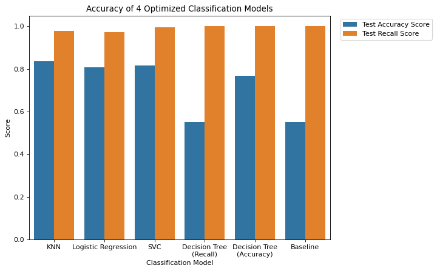
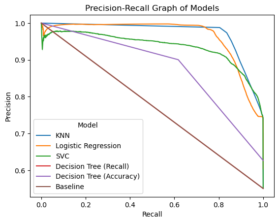

# Cybersecurity-Attacks-Analysis

**Derek Wang**

## Executive Summary
This project is my capstone project for UC Berkeley's MLAI bootcamp. For this project, I needed to come up with my own research question, find the data, and conduct modeling/analysis to answer my question. For this project, I will be analyzing a dataset of network packets and identifying factors which determine if the packet is a cyberattack or not. The goal for the project is to train a classification model that will be able to accurately predict if a packet is normal or malign. The full work and report can be found on this [notebook](https://github.com/DKW2/Cybersecurity-Attacks-Analysis/blob/main/Cybersecurity%20Attacks%20Analysis.ipynb).

## Research Question
Given a dataset of network packets, what factors strongly indicate whether the packet is malignant or not?

## Rationale
With our world becoming more and more digital, the amount of cyberattacks has increased dramatically. Malware, viruses, and other harmful programs can spread through the internet easily and steal private information from innocent people. While anti-virus systems have become a norm in our everyday systems, they still do not guarantee safety. Thus, if we were to have a model that can accurately predict whether a network packet is malignant or not, we can identify the features that determine its identity and advise people on how to protect themselves from the worst. In addition, we can also inform cybersecurity firms and developers on what to focus on.

## Data Sources
The dataset we're using comes from Kaggle [https://www.kaggle.com/datasets/mrwellsdavid/unsw-nb15]. The data is a synthetic dataset created by "Cyber Range Lab of the Australian Centre for Cyber Security (ACCS) for generating a hybrid of real modern normal activities and synthetic contemporary attack behaviours". It contains 2 million records of network packets labelled as either normal or malign. 

## Methodology
I will be using classification models such as Logistic Regression and Decision Trees for this project to try to predict the identity of a network packet. In addition, if I have enough time, I wish to try to learn and utilize random forests to help create a more accurate model. Besides that, I will be using the techniques we've been taught in this class such as feature engineering and hyperparameter grid searching.

## Report/Results
Although the dataset has around 2 million records in total, the authors have also created a training and testing set of a total of 250,000 records. Thus, instead of utilizing every record, I used their train/test sets to lower the computation power. Starting with the training set, I first checked to see that the two classes are slightly unbalanced with a split of around 33-66 (normal, malign). I then proceeded to explore the data, taking note of categorical and numerical features as well as indentifying potential features to manipulate/remove. The features were all cleaned very well, so there wasn't much that needed to be done on my end. One feature that had to be removed was the "id" feature, since it's not a feature of the packet.

Once I cleaned the data, I first created a baseline model to have a threshold for my models to beat. The model would always output "malign", resulting in a baseline accuracy of around 55% and recall of 100%. Once the baseline was established, I began training the classification models. For this project, I trained 4 different types of classification models: K-Nearest Neighbors (KNN), Logistic Regression, Support Vector Machines (SVC), and Decision Trees. For the first run, I trained all four models and optimized each one with hyperparameter searching. The scoring metric I chose was recall, since want to maximize the amount of malign packets we can identify. It's fine if we mistake a normal packet for a malign packet since we're just being careful. However, if we identify a malign packet as normal, there could be consequences. One small hiccup, however, was that training a decision tree using recall results in a model that is identical to the baseline model since both have a recall of 100%. Thus, it's more optimal to train the decision tree using accuracy instead. That's why in the following results, there will be 2 decision trees:

Impressively enough, all of our optimized models had a recall of 97% and higher while the accuracy is around 80%. However, it's difficult to compare the models to the baseline with a recall of 100%. In addition, this doesn't give a very clear picture on which model performed the best. Thus, for a clearer depiction, we'll use Precision-Recall curves to get a better picture of how well each model did. For each model, the closer the curve is to the top right corner, the better the model:

As we can see, KNN performed the best with Logistic Regression and SVC performing slightly worse than it.

Now that we have trained our optimized models, I proceeded to examine each model for overlapping features that strongly impacted the model's predictions. This meant examining the branches in the decision tree, searching through the coefficients in the Logistic Regression model, and using permutation_importance to find the most important features. After I analyzed all 4 models, we can definitely see some stand-out impactful features that overlapped in all of them. These all involve either the packet details or the protocol used to send them. Below are some of the findings:
* We found that "Time to live value" is very impactful in determining whether a packet is normal or malign. This value represents how long a packet can travel on the internet before being deleted. Lower values lead to normal packets while higher values point toward malignant packets.
* High values in features dealing with packet size and limit such as TCP window advertisement value, bits per second, mean transmited packet size have a strong indication of a normal packet. This is probably because they imply a stable and secure connection between two parties rather than a sneaky method of injecting a malign packet.
* Protocol is also a very strong factor in determining a packet's validity. Packets that utilize popular protocols such as TCP, UDP, and FTP strongly suggests that the packets are normal. This is probably due to the amount of scrutinance and work put into these protocols to make them as secure and safe as possible. Meanwhile, packets that utilize less frequently used protocols have a higher rate of being a malign packet. This is probably due to there being more security holes and supervision when using these protocols.

In essense, we can determine if a packet is normal or malignant by examining the packet transmission details and utilized protocol services. Most malignant packets utilize less popular and secure protocols while normal packets utilize popular protocols such as TCP and UDP. In addition, malignant packets usually have longer life time on the internet and are smaller than normal packets.

Thus, through this project, I trained classification models that can accurately identify malignant packets while also discovering strong features that indicate whether a network packet is normal or malign.

## Summary

With a dataset of network packets collected by the Australian Centre for Cyber Security, we trained multiple classification models to determine whether a network packet was normal or malign. Once trained, all of the models had pretty high performance, sporting 80% accuracy and around 97% recall. After training the models, we examined each model to find features that strongly impacted the models in their predictions. These features are strong indicators for normal or malign packets, allowing us to gain some insight on how these models work. From our analysis, we deduced that the strongest indicators for a network packet are the packet transmission details and utilized service/protocol. Malign packets and normal packets seem to utilize different protocols when being sent. In addition, while malign packets are usually small in size and try to last on the network for as long as possible, normal packets tend to be larger in size and are transferred more securely.

## Next Steps / Recommmendations

With such a high recall and accuracy for every model, a next step would be to utilize these classification models in cybersecurity tools that identify malign packets. This way, people can be more protected against malignant agents trying to steal their information or assets. Another way is just to inform cybersecurity experts about these results, discussing which features are strong indicators and seeking what their opinion is on the matter. This creates discussion and spreads discourse about identifying network packets, which will keep people's digital lives safer in the long run.

In addition, although our models performed well, it's worth using data provided by other sources to confirm/reject the current results we've gotten. The dataset we used for this project is synthetic, meaning that not all of it is real data. This raises the concern that perhaps the data might be completely reflective of real life network packets. Thus, it's worth double checking by utilizing other data.

Besides that, another next step is focusing on creating more accurate models. Currently, Logistic Regression and SVC take a really long time to fit (even with all my computer's processors working in tandam). As such, it's just not feasible to conduct deep hyperparameter searches for these models. However, from our analysis, we've confirmed that many features simply don't have any impact on the model. Thus, if we were to trim the dataset to only include the impactful features, it will be easier to conduct deeper hyperparameter searches for our models. In addition, we can utilize more advanced models such as Random Forests to get better classification models.

For recommendations, I would suggest people to use popular network protocols when transferring data. It's only when you start using less used protocols or access less secure sites/downloads when you begin to run across malignant network packets. For general folk, it would probably boil down to just being aware of the dangers of receiving suspicious advertisements or download links and not accessing insecure web sites.

## Outline of project
- [Link to notebook](https://github.com/DKW2/Cybersecurity-Attacks-Analysis/blob/main/Cybersecurity%20Attacks%20Analysis.ipynb)

## Contact and Further Information
To inquire about the project or contact me, email me at derek.kiah.wang@gmail.com
